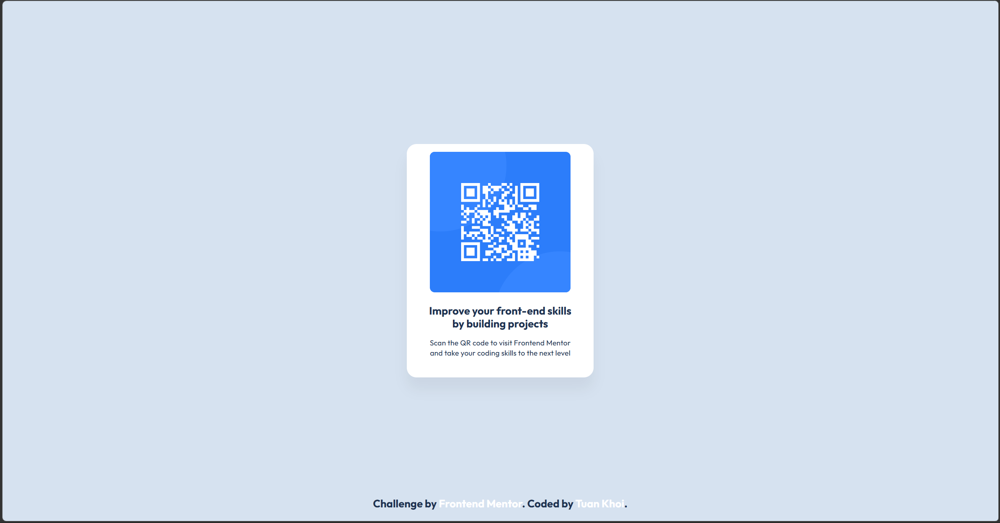
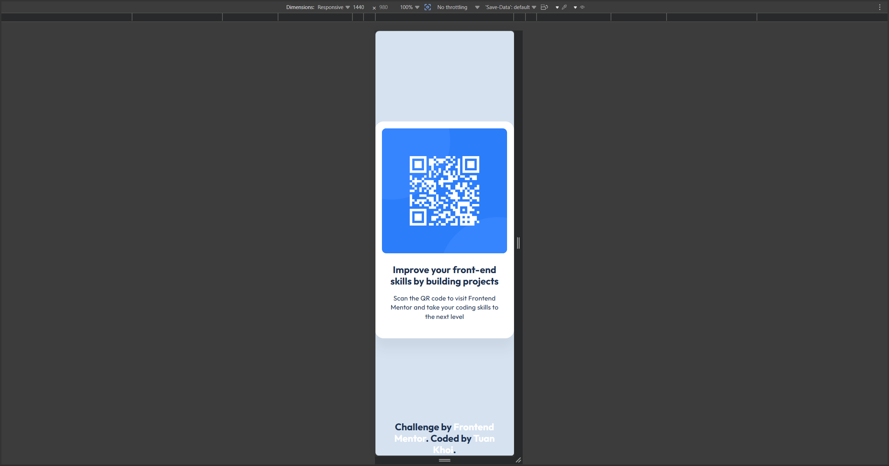

# Frontend Mentor - QR code component solution

This is a solution to the [QR code component challenge on Frontend Mentor](https://www.frontendmentor.io/challenges/qr-code-component-iux_sIO_H). Frontend Mentor challenges help you improve your coding skills by building realistic projects.

## Table of contents

- [Overview](#overview)
    - [Screenshot](#screenshot)
    - [Links](#links)
- [My process](#my-process)
    - [Built with](#built-with)
    - [Useful resources](#useful-resources)
    - [AI Collaboration](#ai-collaboration)
- [Author](#author)

## Overview

### Screenshot

#### Desktop

#### Mobile (320px)

### Links

- Solution URL: [Add solution URL here](https://your-solution-url.com)
- Live Site URL: [Add live site URL here](https://your-live-site-url.com)

## My process

### Built with

- Semantic HTML5 markup
- Custom typography classes
- Flexbox
- Mobile-first workflow

### ai-collaboration

I use Copilot for the purpose of translating this markdown into English (My English writing skills are quite poor.)

### Useful resources

- [Nu Html Checker ](https://validator.w3.org/#validate_by_input) - This helped me for validate HTML syntax and detect errors and improve code quality and browser compatibility
- [AutoPrefixer CSS Online](https://autoprefixer.github.io/) - If you work with CSS, this tool is highly recommended. It simplifies cross‑browser support and makes your workflow more efficient

## Author

- Frontend Mentor - [@DTKHOI](https://www.frontendmentor.io/profile/DTKHOI)
